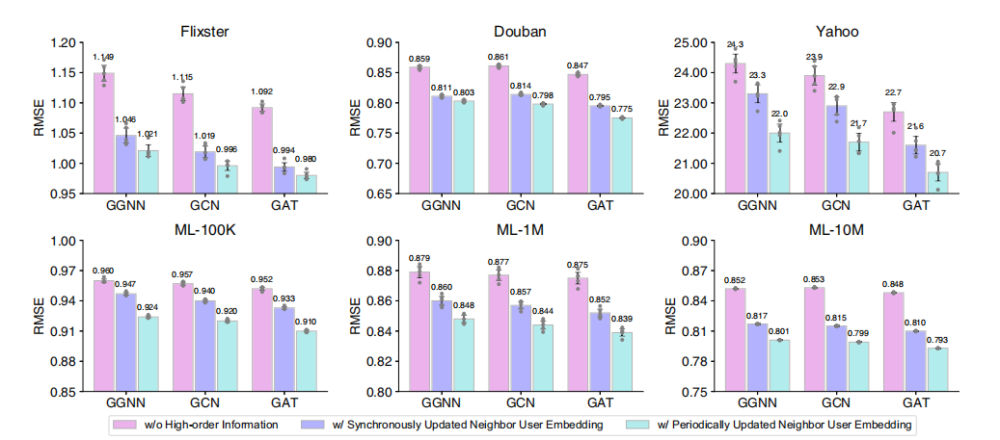
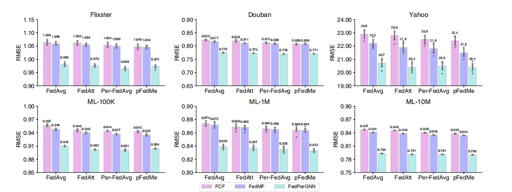
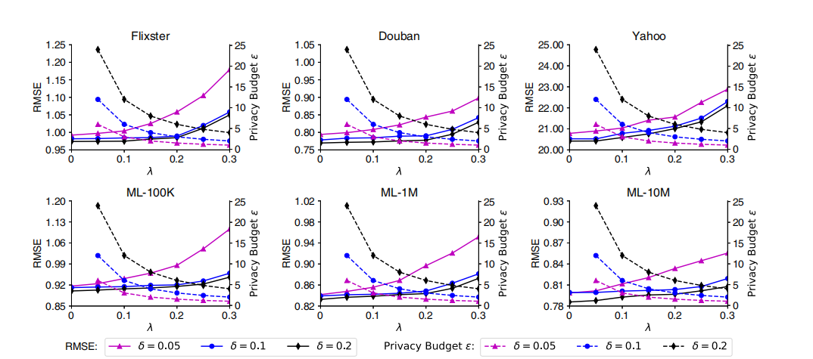
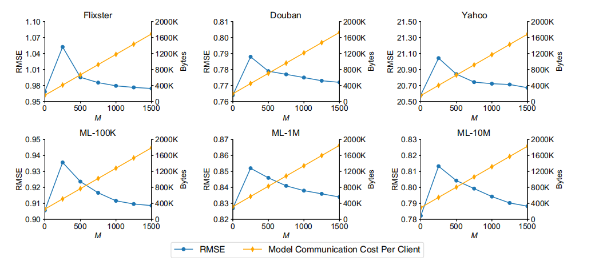
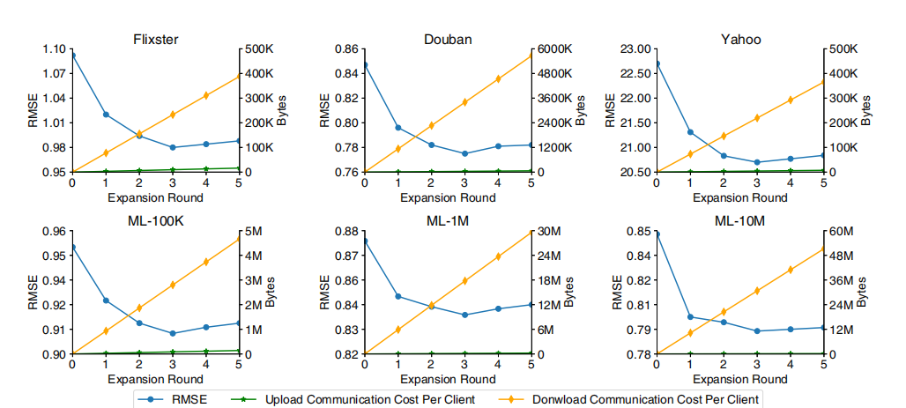
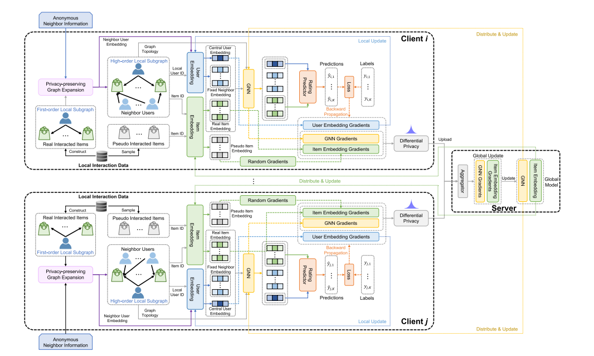
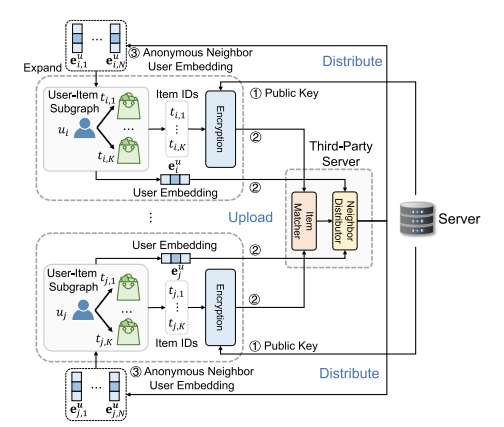

# 一种面向隐私保护个性化的联邦图神经网络框架
吴楚汉¹、吴方昭²✉、吕玲娟³、齐涛¹、黄永锋¹✉、谢幸²  
¹ 清华大学电子工程系，中国北京 100084；² 微软亚洲研究院，中国北京 100080；³ 索尼人工智能公司，日本东京都港区港南 1-7-1，108-0075  
✉ 电子邮箱：fangzwu@microsoft.com；yfhuang@tsinghua.edu.cn  

《自然·通讯》| (2022) 13:3091 | https://doi.org/10.1038/s41467-022-30714-9 | www.nature.com/naturecommunications  

图神经网络（GNN）在建模高阶交互关系方面效果显著，已被广泛应用于推荐系统等各类个性化应用中。然而，主流个性化方法依赖于在全局图上进行集中式GNN学习，由于用户数据具有隐私敏感性，这类方法存在较大隐私风险。本文提出一种名为FedPerGNN的联邦图神经网络框架，旨在实现高效且隐私保护的个性化服务。通过隐私保护模型更新方法，该框架能够基于从本地数据推断出的分布式图协同训练GNN模型。为进一步挖掘本地交互之外的图信息，本文引入隐私保护图扩展协议，在隐私保护前提下融入高阶信息。在6个不同场景的个性化数据集上进行的实验表明，在良好的隐私保护条件下，FedPerGNN相较于当前最先进的联邦个性化方法，误差降低了4.0%~9.6%。FedPerGNN为以隐私保护方式挖掘分布式图数据、实现负责任的智能个性化服务提供了可行方向。

## 1 引言
个性化是网络发展的关键方向之一¹。它能够根据用户的偏好和特征为不同用户提供差异化服务，从而减轻信息过载压力，更好地满足用户个性化需求²。例如，个性化推荐系统可帮助用户筛选出可能感兴趣的产品、视频和新闻³；个性化医疗服务能够辅助健康管理，并根据个人身心状况提供有效的治疗方案⁴⁵。这些个性化服务在提升用户决策能力以及促进用户与物理世界高效交互方面发挥了重要作用⁶⁷。

先进的机器智能系统在推荐⁸、个性化搜索⁹等各类个性化在线应用中占据核心地位。由于网络的社交属性，用户与实体或虚拟物品之间存在大量交互，不同用户之间也存在复杂关联¹⁰。以个性化推荐为例，用户与物品的交互可自然形成二分图，挖掘该图中的有效信息对于理解用户和物品、提升个性化服务质量至关重要¹¹。

图神经网络（GNN）是挖掘图结构数据的有效神经网络架构，能够捕捉图中的高阶内容和拓扑信息¹²。在产品推荐¹³⁻¹⁵、内容推荐¹⁶等个性化场景中，GNN已被广泛用于建模用户与物品之间的复杂交互关系。现有基于GNN的个性化系统之所以能够成功，关键在于依赖集中式图数据进行模型训练——这类图数据通常由大量用户数据汇总构建而成¹⁷。然而，用户数据往往具有高度隐私敏感性，集中式存储和利用会引发用户隐私担忧，且存在数据泄露风险¹⁸。此外，在《通用数据保护条例》（GDPR）¹⁹等严格数据保护法规的约束下，未来在线平台可能无法通过集中存储用户数据来训练用于个性化服务的GNN模型²⁰。

解决这类系统隐私问题的直观思路是将原始数据存储在用户设备本地，并基于本地数据训练GNN模型。但在大多数情况下，用户设备上的数据量过小，难以训练出精准的本地GNN模型。联邦学习是一种隐私保护机器学习范式，能够在隐私保护前提下，基于分布在大量用户客户端上的数据协同学习智能模型²¹。在联邦学习中，仅需交换和聚合客户端基于本地数据计算出的模型更新，原始数据无需离开本地设备。这种范式允许客户端基于本地交互数据推断出的局部图学习本地GNN模型，并将这些本地模型聚合为全局模型以提供个性化服务，这一过程被称为子图级联邦学习²²。然而，该框架仍面临两大挑战：一是基于本地用户数据训练的局部GNN模型可能泄露隐私信息，如何在聚合局部模型生成全局GNN模型时保护用户隐私具有挑战性；二是本地用户数据通常仅包含用户与物品的一阶交互信息，由于隐私限制，不同客户端之间无法直接交换和关联数据，导致高阶交互信息难以获取。现有子图级联邦学习研究²²假设每个客户端拥有较大的子图，且分布在不同客户端上的子图之间不存在充分交互。但在个性化场景中，分布式子图往往规模较小，而子图间的交互对于理解用户兴趣至关重要。因此，在不违反隐私保护要求的前提下，如何利用高阶交互信息提升个性化场景中GNN模型的学习效果，仍是一个亟待解决的难题。

本文提出一种联邦图神经网络框架FedPerGNN，通过隐私保护方式挖掘高阶用户-物品交互信息，为隐私保护个性化服务提供支持。由于隐私限制，不存在全局用户-物品图，因此每个客户端需基于本地交互数据构建用户-物品图，并在此基础上学习本地GNN模型。客户端将模型梯度发送至中央服务器，服务器对多个客户端的梯度进行聚合后，将全局参数分发给各用户设备以进行本地更新。考虑到模型梯度中可能包含隐私信息，本文设计了隐私保护模型更新方法，结合本地差分隐私（LDP）和伪交互物品采样技术，保护用户-物品交互信息。为打破信息孤岛困境，本文还设计了隐私保护图扩展协议，在不泄露用户隐私的前提下挖掘高阶图信息。在6个不同场景的常用个性化数据集上进行的实验表明，在满足隐私预算要求的情况下，FedPerGNN相较于多种当前最先进（SOTA）的隐私保护个性化方法，误差降低了4.0%~9.6%。此外，与其他联邦个性化方法相比，FedPerGNN还具有通信成本低、隐私保护更全面的优势，使其在实际部署中具备可行性。通过深入分析发现，三阶以内的信息对个性化服务最为重要，这一结论为设计高效、精准且隐私保护的个性化在线系统提供了参考。本文的研究成果有望为未来隐私保护个性化服务和分布式图数据挖掘研究提供基础平台。

## 2 实验结果
### 2.1 整体框架
首先简要介绍FedPerGNN的整体框架，该框架用于以隐私保护方式学习基于GNN的个性化模型（**图1**）。它能够利用高度分布式的用户交互数据，在隐私保护前提下挖掘高阶用户-物品交互信息，从而学习GNN模型以提供个性化服务。FedPerGNN的参与方包括：负责协调模型学习的学习服务器、用于查找和分发匿名邻居信息的第三方服务器，以及大量协同学习GNN模型的用户客户端。用户客户端保存局部子图，该子图包含用户与物品的交互历史，以及与该用户有共同交互物品的邻居用户。邻居信息通过定期执行的隐私保护图扩展过程获取，该过程引入可信第三方服务器，用于匹配加密物品并分发匿名用户嵌入。每个客户端基于本地子图学习GNN模型，并将扰动后的梯度上传至中央学习服务器。学习服务器的核心职责是协调各用户客户端进行模型学习，具体包括聚合多个用户客户端上传的梯度，并将聚合后的梯度分发给各客户端。这一过程迭代执行，直至模型收敛。模型训练完成后，用户客户端将本地推断出的用户隐藏嵌入上传至学习服务器，为后续个性化服务提供支持。通过这种方式，可充分利用分布在不同客户端上的高阶信息，缓解信息孤岛问题，同时实现良好的用户隐私保护。

**图1**：FedPerGNN整体框架图。每个用户设备基于本地用户数据推断的局部子图学习局部GNN模型；学习服务器协调大量用户设备协同学习全局GNN模型；隐私保护模型更新方法用于保护学习服务器与客户端之间交换的模型梯度中所编码的用户隐私信息；第三方服务器执行隐私保护图扩展协议，在隐私保护前提下将高阶图信息融入局部模型学习；用户设备将用户嵌入和加密物品ID上传至该服务器以查找用户邻居，匿名邻居用户的嵌入则分发至用户设备，用于扩展局部子图。

### 2.2 性能评估
实验采用6个不同场景下常用的基准个性化数据集。其中3个是MovieLens²³的不同版本（样本量分别为100K、1M和10M），分别记为ML-100K、ML-1M和ML-10M；另外3个是由文献²⁴提供的Flixster、豆瓣（Douban）和雅虎音乐（YahooMusic）数据集，其中雅虎音乐数据集记为Yahoo。数据集的详细统计信息如表S1（补充材料）所示。实验任务是预测用户对未交互物品的评分，为后续个性化服务提供支持。

#### 表1 不同方法在均方根误差（RMSE）指标上的性能表现
| 方法        | Flixster       | Douban         | Yahoo          | ML-100K        | ML-1M          | ML-10M         |
|-------------|----------------|----------------|----------------|----------------|----------------|----------------|
| PMF         | 1.370 ± 0.011  | 1.296 ± 0.009  | 1.150 ± 0.008  | 0.865 ± 0.002  | 0.893 ± 0.002  | 0.840 ± 0.002  |
| SVD++       | 1.248 ± 0.498  | 1.267 ± 0.529  | 1.379 ± 0.786  | 0.970 ± 0.005  | 0.948 ± 0.004  | 0.933 ± 0.002  |
| GRALS       | 1.185 ± 0.007  | 1.086 ± 0.004  | 1.086 ± 0.005  | 0.955 ± 0.0006 | 0.911 ± 0.0002 | 0.933 ± 0.0004 |
| sRGCNN      | 1.170 ± 0.007  | 0.905 ± 0.002  | 1.028 ± 0.482  | 0.921 ± 0.003  | 0.939 ± 0.003  | 0.885 ± 0.0003 |
| GC-MC       | 0.943 ± 0.006  | 0.836 ± 0.001  | 1.004 ± 0.361  | 0.906 ± 0.001  | 0.930 ± 0.001  | 0.878 ± 0.0001 |
| PinSage     | 0.945 ± 0.005  | 0.832 ± 0.001  | 1.010 ± 0.332  | 0.914 ± 0.002  | 0.940 ± 0.002  | 0.890 ± 0.0002 |
| NGCF        | 0.954 ± 0.004  | 0.837 ± 0.001  | 1.012 ± 0.334  | 0.913 ± 0.001  | 0.933 ± 0.002  | 0.884 ± 0.0004 |
| FCF         | 1.064 ± 0.008  | 0.842 ± 0.001  | 1.009 ± 0.370  | 0.916 ± 0.002  | 0.935 ± 0.001  | 0.947 ± 0.0007 |
| GAT         | 0.952 ± 0.005  | 0.923 ± 0.002  | 1.029 ± 0.389  | 0.957 ± 0.002  | 0.974 ± 0.005  | 0.879 ± 0.0003 |
| FedMF       | 1.059 ± 0.006  | 0.917 ± 0.002  | 1.022 ± 0.349  | 0.948 ± 0.002  | 0.972 ± 0.004  | 0.941 ± 0.0005 |
| FedPerGNN   | 0.980 ± 0.006  | 0.875 ± 0.001  | 1.007 ± 0.325  | 0.910 ± 0.001  | 0.939 ± 0.003  | 0.893 ± 0.0002 |

*注：FedPerGNN和表现最佳的基准方法结果已加粗标注。FedPerGNN相较于其他最先进的隐私保护个性化方法（FCF和FedMF）具有显著优势（p<0.001）；同时，FedPerGNN与其他基于集中式GNN的个性化方法性能相当，且在Yahoo数据集上，FedPerGNN与表现最佳方法之间无显著差异（p>0.1）。*

将FedPerGNN与多种基于用户数据集中存储的个性化方法进行对比，包括：概率矩阵分解（PMF）²⁵、奇异值分解变体（SVD++）²⁶、结合图信息的协同过滤方法GRALS²⁷、基于循环多图神经网络的矩阵补全方法sRGCNN²⁴、基于图卷积自编码器的矩阵补全方法GC-MC²⁸、基于图卷积的方法PinSage¹³、神经图协同过滤（NGCF）¹⁴，以及图注意力网络（GAT）²⁹。此外，还与多种基于联邦学习的先进隐私保护方法进行对比，包括联邦协同过滤（FCF）³⁰和联邦矩阵分解（FedMF）³¹。采用预测评分与真实评分之间的均方根误差（RMSE）评估不同方法的评分预测性能，并报告5次独立实验的平均值及标准差（表1）。

实验观察到，利用用户-物品图中高阶信息的方法（如GC-MC、PinSage、NGCF）相较于仅利用一阶信息的方法（如PMF）性能更优。这是因为建模用户与物品之间的高阶交互关系能够提升用户和物品的表示学习效果，进而提高个性化服务的准确性。此外，与GC-MC、NGCF等基于用户数据集中存储的方法相比，FedPerGNN能够实现相当甚至更优的性能。例如，在Yahoo数据集上，FedPerGNN与表现最佳的基准方法之间的性能差异无统计学意义（p>0.1），这表明FedPerGNN在保护用户隐私的同时，能够实现令人满意的个性化服务性能。在所有对比的隐私保护个性化方法中，FedPerGNN表现最佳。例如，与FedMF相比，FedPerGNN在不同数据集上的预测误差降低了4.0%~9.6%（相较于FCF的提升更为显著），且这种差异具有统计学意义（p<0.001）。这得益于FedPerGNN能够以隐私保护方式挖掘用户-物品图中的高阶信息，从而更深入地理解用户和物品特征。上述结果验证了FedPerGNN在隐私保护个性化服务中的有效性。

为进一步凸显FedPerGNN的优势，从高阶上下文利用和隐私保护两个维度与基准方法进行对比（表2）。现有许多方法依赖用户数据集中存储，无法实现用户隐私保护；而在隐私保护个性化方法中，大多无法挖掘高阶图信息。此外，这些方法仅能保护用户的私有评分，若要保护用户与物品的交互历史，需在每个客户端存储所有物品及其嵌入，这在实际系统中难以实现。相比之下，FedPerGNN能够同时保护用户评分和用户-物品交互历史，实现更全面的隐私保护。

#### 表2 不同方法在高阶用户-物品交互建模与隐私保护方面的对比
|                | PMF  | SVD++ | GRALS | sRGCNN | GC-MC | PinSage | NGCF | GAT  | FCF  | FedMF | FedPerGNN |
|----------------|------|-------|-------|--------|-------|---------|------|------|------|-------|-----------|
| 高阶信息利用    | ×    | ✓     | ✓     | ✓      | ✓     | ✓       | ✓    | ✓    | ×    | ×     | ✓         |
| 评分保护        | ×    | ×     | ×     | ×      | ×     | ×       | ×    | ×    | ✓    | ✓     | ✓         |
| 交互物品保护    | ×    | ×     | ×     | ×      | ×     | ×       | ×    | ×    | ×    | ×     | ✓         |
| 用户数据存储方式 | 集中式 | 集中式 | 集中式 | 集中式 | 集中式 | 集中式 | 集中式 | 集中式 | 分布式 | 分布式 | 分布式     |

*注：“集中式（Central）”和“分布式（Local）”分别表示数据的集中式存储和分布式存储。现有集中式图学习方法可利用高阶图信息，但无法保护用户隐私；现有基于联邦学习的方法仅能保护用户的私有评分，无法挖掘高阶上下文信息；FedPerGNN可将高阶信息融入图挖掘过程，同时保护用户评分和历史交互物品信息。*

### 2.3 模型有效性验证
接下来验证融入用户-物品图高阶信息的有效性，以及FedPerGNN框架的通用性。将FedPerGNN与其变体（包括同步更新邻居用户嵌入的变体和未利用高阶用户-物品交互的变体）进行性能对比；同时，在不同GNN模型架构（包括门控图神经网络（GGNN）³²、图卷积网络（GCN）³³和图注意力网络（GAT）²⁹）下，对比各方法的性能表现（**图2**），得出以下结论：

1. 与表1中基准方法的性能相比，采用不同GNN模型架构的FedPerGNN及其变体均表现出令人满意的性能，这表明该框架与不同GNN架构具有兼容性，可作为基于GNN的个性化服务通用框架。
2. 基于GAT的FedPerGNN略优于基于GCN和GGNN的变体，原因在于GAT能够比GCN和GGNN更有效地建模节点间交互的重要性，这对用户和物品建模具有积极作用。
3. 能够利用邻居用户嵌入中编码的高阶信息的变体，其性能优于未利用高阶信息的变体，这验证了将用户-物品图高阶信息融入个性化服务的有效性。
4. 采用周期性更新邻居用户嵌入的方式，略优于采用全可训练且每次迭代同步更新的方式。这可能是因为在模型训练初期，邻居用户嵌入的准确性较低，同步更新不利于学习精准的用户和物品表示。

**图2**：邻居用户信息与不同GNN架构对模型性能的影响图。误差线表示5次独立实验的均值及95%置信区间；GGNN为门控图神经网络，GCN为图卷积网络，GAT为图注意力网络。结果表明，融入邻居用户嵌入中编码的高阶信息可有效降低预测误差，且采用周期性更新的邻居用户嵌入效果优于同步更新的嵌入。

进一步分析不同联邦模型更新方法对FedPerGNN有效性的影响（**图3**），涉及的联邦更新方法包括FedAvg²¹、FedAtt³⁴、Per-FedAvg³⁵和pFedME³⁶，并以FCF和FedMF作为参考基准。实验发现：

1. FedAtt、Per-FedAvg、pFedME等先进联邦模型更新方法略优于基础的FedAvg方法，其中个性化联邦学习方法Per-FedAvg和pFedME通常表现最佳，这是因为个性化联邦学习能够更好地处理个性化场景下用户数据的异质性。
2. 在不同联邦模型更新方法下，FedPerGNN相较于FCF、FedMF等其他联邦个性化方法，均能实现稳定的性能提升，这验证了FedPerGNN在适配不同联邦学习框架方面的通用性。

**图3**：不同联邦更新方法对模型性能的影响图。误差线表示5次独立实验的均值及95%置信区间。结果表明，FedPerGNN在不同类型的联邦模型更新方法下均能保持有效性，且采用更复杂的联邦更新方法可带来轻微性能提升。

### 2.4 超参数分析
研究多个关键超参数对FedPerGNN性能、隐私保护效果和通信成本的影响：

#### 2.4.1 梯度裁剪阈值与噪声强度的影响
通过调整LDP模块中的梯度裁剪阈值δ和拉普拉斯噪声强度λ，对比FedPerGNN的性能与隐私预算（**图4**）。其中，λ越大、δ越小，隐私预算ε越小，隐私保护效果越好。实验结果显示：

1. δ=0.1和δ=0.2时，模型性能差异较小；但当裁剪阈值减小到0.05时，预测误差显著增大。因此，选择δ=0.1，在保障较好隐私保护效果的同时，避免过多牺牲模型性能。
2. 随着噪声强度λ的增大，模型性能逐渐下降，但当λ处于适中范围时，性能损失较小。因此，将λ设为0.2，在该设置下可实现3-差分隐私，同时在隐私保护与个性化准确性之间取得良好平衡。

**图4**：不同梯度裁剪阈值δ和噪声强度λ下的个性化RMSE（左y轴）与隐私预算ε（右y轴）图。RMSE越低表示性能越好，隐私预算越低表示隐私保护效果越好；λ=0时隐私预算为无穷大。当裁剪阈值δ为0.1或0.2时，性能损失相近；当δ为0.05时，性能损失显著增大；噪声强度越大，性能损失也越大。在δ=0.1、λ=0.2（迭代轮次为3）的设置下，FedPerGNN可实现3-差分隐私。

#### 2.4.2 伪交互物品数量的影响
对比不同伪交互物品数量M对FedPerGNN性能和通信成本的影响（**图5**）。采用模型训练过程中每次迭代交换的参数数量衡量通信成本，实验结果显示性能曲线存在一个特殊峰值：

1. 当M=0时，模型性能最佳，但无法保护用户-物品交互历史；当M>0时，由于随机生成的梯度会影响物品梯度的准确性，模型性能有所下降，但随着M增大，性能损失逐渐减小。这是因为当M较大时，伪交互物品的随机梯度在聚合后能够更好地相互抵消，其影响得到有效缓解。
2. 在MovieLens数据集上，模型至少可实现1000/M-指数隐私（方法部分将详细讨论），在其他数据集上的隐私保护效果更优。因此，M过小时无法实现良好的用户隐私保护；但通信成本与M成正比，M过大将导致通信成本过高。
3. 当M>1000时，性能提升趋于平缓，因此选择M=1000，在实现1-指数隐私和良好个性化性能的同时，保证通信成本处于合理范围。

**图5**：不同伪交互物品数量M下的个性化RMSE（左y轴）与通信成本（右y轴）图。上传和下载的通信成本相同；当无伪交互物品（M=0）时，模型性能最优，但无法保护用户交互历史；M过小时性能损失较大，M增大时性能提升且用户隐私保护效果更好；由于通信成本与M成正比，因此选择适中的M值（如1000）。

#### 2.4.3 图扩展轮次的影响
评估不同隐私保护图扩展轮次对FedPerGNN性能及上传/下载通信成本的影响（**图6**），实验发现：

1. 当扩展轮次从0增加到3时，误差逐渐降低，且性能提升主要来自前两轮扩展，这表明前三阶图信息对个性化服务最为重要。
2. 扩展轮次过多时，性能反而下降，这可能是由于GNN模型存在过平滑问题³⁷。
3. 通信成本主要来自匿名邻居用户嵌入的下载，且与扩展轮次成正比。因此，选择3轮扩展，在可接受的通信成本内实现最佳性能。由于下载带宽通常比上传带宽更充足³⁸，FedPerGNN在实际场景中具有较强的实用性。

**图6**：不同图扩展轮次下的个性化RMSE及上传/下载通信成本图。当扩展轮次从0增加到3时，误差降低，且性能提升主要来自前两轮扩展，表明前三阶图信息对个性化最为重要；扩展轮次过多时性能下降（可能因GNN过平滑问题）；通信成本与扩展轮次成正比，且下载通信成本远高于上传成本；选择3轮扩展可在可接受的通信成本内实现最佳性能。

## 3 讨论
本文提出FedPerGNN，一种面向隐私保护的基于GNN的联邦个性化框架，旨在通过隐私保护方式挖掘高阶交互信息，基于分布式用户数据协同训练GNN模型。在该方法中，每个用户客户端可基于本地存储的用户-物品图训练GNN模型，并将本地计算的梯度上传至服务器进行聚合；聚合后的梯度再分发给各客户端，用于本地参数更新。由于交互的模型梯度可能包含用户隐私信息，本文设计了隐私保护模型更新方法，以保障模型训练过程中的用户隐私。与仅能保护用户私有评分的现有方法不同，FedPerGNN可同时保护用户评分和交互历史，实现更全面的隐私保护。此外，该方法无需传输和本地存储全局物品集，通信开销通常在现代个人设备的可接受范围内，因此更易于在实际个性化服务中部署。

由于从本地用户数据推断出的局部用户-物品图仅包含低阶交互信息，本文提出隐私保护用户-物品图扩展协议，在隐私保护前提下扩展局部图并传播高阶信息。在该过程中，每个客户端接收匿名用户嵌入以扩展局部子图，这有助于在隐私保护前提下传播用户-物品图中的高阶信息，从而提升GNN模型性能。仅需少数几轮隐私保护图扩展，即可在不产生高额通信成本的前提下，有效挖掘用户-物品图中的高阶信息。此外，该方法不仅局限于个性化场景，还可作为分布式图数据隐私保护挖掘的基础技术，有望为涉及图结构数据的多个领域研究提供支持。

在6个不同场景的真实数据集上进行的大量实验表明，FedPerGNN与现有基于集中式数据存储的GNN方法性能相当，且相较于最先进的隐私保护方法，预测误差降低了4.0%~9.6%。实验结果进一步验证了FedPerGNN在提升不同架构GNN模型性能方面的通用性，表明其有望成为隐私保护GNN模型学习的通用基准。此外，FedPerGNN能够在准确性、隐私保护和通信成本之间取得良好平衡，在实际应用中具有较大潜力。通过图扩展分析发现，前三阶图信息是个性化服务的核心，这一结论可为研究人员揭示GNN模型内在机制、帮助从业者开发高效精准的图建模系统提供有益指导。

本文提出的FedPerGNN可作为隐私保护下分布式图数据挖掘的模板框架，对通信资源有限的客户端友好，且支持大量客户端协同进行模型学习。此外，FedPerGNN在智能医疗、城市计算、量化金融等涉及私有图数据的场景中也具有应用潜力，有望为相关领域研究提供启发，推动机器智能系统在有效性和责任感方面的提升。

然而，FedPerGNN仍存在以下局限性：一是该框架假设第三方服务器可信且不与推荐服务器串通，这一假设条件较为严格；二是当攻击者控制大量恶意客户端时，FedPerGNN的安全性可能受到威胁。因此，未来将研究如何防御来自恶意客户端和平台的主动攻击，并探索FedPerGNN在实际个性化系统中的有效安全部署，以在隐私保护前提下为用户提供服务。

## 4 方法
本节首先介绍FedPerGNN框架中的问题定义，然后详细阐述FedPerGNN的实现细节，最后对隐私保护效果进行讨论和分析。

### 4.1 问题定义
设用户集合为\(U=\{$u_{1}$, $u_{2}$, ..., $u_{P}$\}\)，物品集合为\(T=\{$t_{1}$, $t_{2}$, ..., $t_{Q}$\}\)，其中P为用户数量，Q为物品数量。用户与物品之间的评分矩阵记为\(Y \in $\mathbb{R}^{P \times Q}$\)，基于观测评分\($Y_{0}$\)可构建二分用户-物品图G。假设用户\($u_{i}$\)与K个物品存在交互，记为\([$t_{i, 1}$, $t_{i, 2}$, ..., $t_{i, K}$]\)，这些物品与用户\($u_{i}$\)可构成一阶局部用户-物品子图\($G_{i}$\)（补充图4中的非阴影区域）。用户\(u_{i}\)对这些物品的评分记为\([$y_{i, 1}$, $y_{i, 2}$, ..., $y_{i, K}$]\)。

为保护用户隐私（包括私有评分和交互物品信息），每个用户设备本地存储自身的交互数据，原始数据始终不离开本地设备。研究目标是在隐私保护前提下，基于用户设备本地存储的交互数据\($G_{i}$\)预测用户评分。需注意的是，FedPerGNN中不存在全局用户-物品交互图，局部图在不同设备上独立构建和存储，这与现有联邦GNN方法²²、³⁹、⁴⁰存在本质区别——后者要求完整的图在至少一个平台或设备上集中构建和存储。

### 4.2 FedPerGNN框架细节
以下详细介绍FedPerGNN如何以隐私保护方式训练基于GNN的个性化模型（**图7**）。每个用户客户端的局部子图由用户-物品交互数据和与该用户有共同交互物品的邻居用户构建而成：用户节点与交互物品节点相连，物品节点进一步与匿名邻居用户节点相连。

首先通过嵌入层将用户节点\(u_{i}\)、K个物品节点\([t_{i, 1}, t_{i, 2}, ..., t_{i, K}]\)和N个邻居用户节点\([u_{i, 1}, u_{i, 2}, ..., u_{i, N}]\)转换为嵌入向量，分别记为\(e_{i}^{u}\)、\([e_{i, 1}^{t}, e_{i, 2}^{t}, ..., e_{i, K}^{t}]\)和\([e_{i, 1}^{u'}, e_{i, 2}^{u'}, ..., e_{i, N}^{u'}]\)。由于模型未充分调优时用户嵌入的准确性较低，在模型训练初期暂不引入邻居用户嵌入，待其调优后再融入模型学习。需注意的是，用户\(u_{i}\)的嵌入和物品嵌入在模型训练过程中同步更新，而邻居用户嵌入采用周期性更新方式。

**图7**：FedPerGNN详细框架图。每个客户端本地存储交互数据，并基于该数据构建一阶局部子图；通过邻居用户对局部子图进行扩展，同时从本地交互数据中采样若干伪交互物品以隐藏真实交互物品；邻居用户嵌入固定，中心用户嵌入在本地更新；物品嵌入和GNN梯度在上传至服务器聚合前进行扰动处理，聚合后的梯度分发给客户端用于本地更新。

接下来，将图神经网络应用于上述嵌入向量，对局部一阶子图中的节点间交互关系进行建模。该框架可兼容多种GNN网络，如GCN³³、GGNN³²和GAT²⁹。GNN模型输出用户节点和物品节点的隐藏表示，分别记为\(h_{i}^{u}\)、\([h_{i, 1}^{t}, h_{i, 2}^{t}, ..., h_{i, K}^{t}]\)和\([h_{i, 1}^{u'}, h_{i, 2}^{u'}, ..., h_{i, N}^{u'}]\)。

随后，评分预测模块基于用户和物品的嵌入向量，预测用户\(u_{i}\)对其交互物品的评分（记为\([\hat{y}_{i, 1}, \hat{y}_{i, 2}, ..., \hat{y}_{i, K}]\)）。将预测评分与用户设备本地存储的真实评分进行对比，计算损失函数。对于用户\(u_{i}\)，损失函数\(L_{i}\)定义为：
\[L_{i}=\frac{1}{K} \sum_{j=1}^{K}|\hat{y}_{i, j}-y_{i, j}|^{2}\]
基于损失\(L_{i}\)计算模型和嵌入的梯度，分别记为\(g_{i}^{m}\)和\(g_{i}^{e}\)，并将这些梯度上传至服务器进行聚合。

服务器的核心功能是协调所有用户设备，计算全局梯度以更新各设备中的模型和嵌入参数。在每一轮迭代中，服务器唤醒若干用户客户端进行本地梯度计算，并接收这些客户端上传的梯度；服务器中的聚合器将多个本地梯度聚合为统一梯度\(g\)（采用FedAvg²¹算法实现聚合）；随后，服务器将聚合后的梯度分发给各客户端，用于本地参数更新。设第i个用户设备的参数集为\(\Theta_{i}\)，参数更新公式为：
\[\Theta_{i}=\Theta_{i}-\alpha g\]
其中α为学习率。上述过程迭代执行，直至模型收敛。模型训练完成后，用户客户端将本地推断出的用户隐藏嵌入上传至服务器，为后续个性化服务提供支持。

FedPerGNN的学习框架总结于补充算法1，其中包含两个核心隐私保护模块：一是隐私保护模型更新模块（对应算法1的第9-13行），用于保护模型更新过程中的梯度隐私；二是隐私保护用户-物品图扩展模块（对应算法1的第15行），用于在建模高阶用户-物品交互时保护用户隐私。

### 4.3 隐私保护模型更新
若直接上传GNN模型和物品嵌入梯度，可能引发隐私问题，原因如下：一是对于嵌入梯度，仅用户交互过的物品其嵌入梯度非零，服务器可通过非零物品嵌入梯度直接还原完整的用户-物品交互历史；二是除嵌入梯度外，GNN模型和评分预测器的梯度也可能泄露用户历史和评分隐私⁴¹，因为GNN模型梯度中编码了用户对物品的偏好信息。

现有方法（如FedMF³¹）采用同态加密技术对梯度进行处理，以保护私有评分，但该方法要求用户设备本地存储完整物品集T的嵌入表，并在每次迭代中上传，导致存储和通信成本极高，在实际模型训练中难以实现。

为解决上述问题，提出两种策略以保护模型更新过程中的用户隐私：

#### 4.3.1 伪交互物品采样
采样M个用户未交互过的物品，基于与真实物品嵌入梯度相同的均值和协方差，采用高斯分布随机生成这些伪交互物品的梯度\(g_{i}^{p}\)。伪交互物品的采样方式多样，例如可选择用户未交互过的展示物品，实验中为简化模拟，直接从完整物品集中随机采样。将真实嵌入梯度\(g_{i}^{e}\)与伪物品嵌入梯度\(g_{i}^{p}\)结合，第i个用户设备上模型和嵌入的统一梯度（对应算法1第27行）调整为：
\[g_{i}=(g_{i}^{m}, g_{i}^{e}, g_{i}^{p})\]

#### 4.3.2 本地差分隐私（LDP）
参考文献⁴²的方法，在用户客户端基于L1范数对本地梯度进行裁剪（裁剪阈值为δ），并对统一梯度应用零均值拉普拉斯噪声的LDP⁴³模块，以增强用户隐私保护，具体公式如下：
\[g_{i}=clip(g_{i},\delta )+Laplace(0,\lambda ) \quad (1)\]
其中λ为噪声规模。隐私预算ε的上界为\(\frac{2 \delta e}{\lambda}\)（e为迭代轮次）。将经过保护处理的梯度\(g_{i}\)上传至学习服务器进行聚合。

### 4.4 隐私保护用户-物品图扩展
以下介绍隐私保护用户-物品图扩展协议，该协议旨在以隐私保护方式查找用户邻居并扩展局部用户-物品图。在基于集中式图存储的现有GNN个性化方法中，可直接从全局用户-物品图中提取高阶用户-物品交互信息；但当用户数据分布式存储时，如何在不违反隐私保护要求的前提下融入高阶用户-物品交互信息，是一项具有挑战性的任务。

为解决这一问题，设计隐私保护用户-物品图扩展协议：在保护用户隐私的同时，查找用户的匿名邻居以提升用户和物品的表示学习效果，其框架如**图8**所示。具体步骤如下：

1. 维护个性化服务的中央学习服务器生成公钥，并分发给所有用户客户端用于加密操作。
2. 用户客户端接收公钥后，采用RSA（Rivest–Shamir–Adleman）加密算法对其交互过的物品ID进行加密（物品ID属于隐私敏感信息），并将加密后的物品ID及该用户的嵌入向量上传至可信第三方服务器。
3. 第三方服务器通过匹配物品ID密文，查找与当前用户有共同交互物品的其他用户，并将这些匿名邻居用户的嵌入向量提供给当前用户。
4. 将每个匿名用户节点与其交互的物品节点相连，从而在不影响用户隐私保护的前提下，通过高阶用户-物品交互信息丰富局部用户-物品子图。

在这一过程中，个性化服务服务器始终不获取用户隐私信息；第三方服务器由于无法解密物品ID，也无法获取用户和物品的隐私信息。扩展后的局部用户-物品子图示例结构如补充图4所示，其中阴影区域为通过图扩展方法新增的部分。隐私保护用户-物品图扩展协议的流程总结于补充算法2。

**图8**：隐私保护用户-物品图扩展协议框架图。学习服务器首先生成公钥并发送给客户端，用于加密本地物品ID；客户端将加密后的物品ID上传至第三方服务器，第三方服务器通过匹配物品ID密文找到具有共同交互物品的用户；将这些用户视为邻居，匿名邻居用户的嵌入及其关联的加密物品节点分发给客户端，用于扩展局部子图。

### 4.5 隐私保护效果分析
FedPerGNN从四个方面实现用户隐私保护：

1. 个性化服务器不收集原始用户-物品交互数据，仅接收客户端本地计算的梯度。根据数据处理不等式可推断，这些梯度包含的隐私信息远少于原始用户交互数据²¹。
2. 第三方服务器由于无法获取私钥，无法从加密物品ID中推断隐私信息。但若个性化服务器与第三方服务器串通（交换私钥和物品表），则用户交互历史可能泄露；不过，隐私保护模型更新方法仍可保护用户私有评分。
3. 伪交互物品采样方法通过采样用户未交互过的物品，保护真实交互物品信息。由于真实物品和伪交互物品的梯度具有相同的均值和协方差，当伪交互物品数量足够大时，服务器难以区分真实交互物品和伪交互物品。文献⁴⁴证明，FedPerGNN可实现\(\frac{K}{M}\)-指数隐私（指数隐私值越小，隐私保护效果越好）。因此，在用户设备计算资源允许的情况下，可通过增加伪交互物品数量进一步提升隐私保护效果。
4. 对用户设备本地计算的梯度应用LDP技术，增加了从梯度中还原原始用户消费历史的难度。文献⁴²表明，隐私预算ε的上界为\(2\delta e/\lambda\)，这意味着可通过减小裁剪阈值δ或增大噪声强度λ，降低隐私预算ε，从而提升隐私保护效果。但需注意，隐私预算过小时会导致模型梯度准确性下降，因此需合理选择这两个超参数，在模型性能与隐私保护之间取得平衡。

## 5 报告摘要
有关本研究设计的更多信息，可参考本文链接的《自然研究报告摘要》（Nature Research Reporting Summary）。

## 6 数据可用性
本研究使用的所有数据集均为公开可用数据集，实验和分析过程严格遵循数据集原始许可协议。其中，MovieLens数据集（100K、1M、10M版本）可通过https://grouplens.org/datasets/movielens/获取；Flixster、豆瓣（Douban）和雅虎音乐（YahooMusic）数据集可通过https://github.com/fmonti/mgcnn获取。本文同时提供了研究使用的原始数据。

## 7 代码可用性
本研究使用的代码可通过https://github.com/wuch15/FedPerGNN⁴⁵获取。此外，方法部分和补充材料中详细描述了所有实验步骤和实现细节，确保研究结果的可复现性。

收稿日期：2022年1月11日；录用日期：2022年5月13日；在线发表日期：2022年6月2日

## 8 参考文献
1. Eirinaki, M. & Vazirgiannis, M. Web mining for web personalization. ACM TOIT 3, 1–27 (2003).  
2. Mobasher, B. Data mining for web personalization. In The adaptive web, 90–135 (Springer, 2007).  
3. Zhang, S., Yao, L., Sun, A. & Tay, Y. Deep learning based recommender system: a survey and new perspectives. ACM Comput. Surveys 52, 1–38 (2019).  
4. Cahan, E. M., Hernandez-Boussard, T., Thadaney-Israni, S. & Rubin, D. L. Putting the data before the algorithm in big data addressing personalized healthcare. NPJ Digital Med. 2, 1–6 (2019).  
5. Iqbal, S., Mahgoub, I., Du, E., Leavitt, M. A. & Asghar, W. Advances in healthcare wearable devices. npj Flexible Electronics 5, 1–14 (2021).  
6. Yu, H., Miao, C., Leung, C. & White, T. J. Towards ai-powered personalization in mooc learning. npj Sci. Learning 2, 1–5 (2017).  
7. Lorenz-Spreen, P., Lewandowsky, S., Sunstein, C. R. & Hertwig, R. How behavioural sciences can promote truth, autonomy and democratic discourse online. Nature Hum. Behav. 4, 1102–1109 (2020).  
8. Isinkaye, F. O., Folajimi, Y. O. & Ojokoh, B. A. Recommendation systems: principles, methods and evaluation. Egyptian Inform. J 16, 261–273 (2015).  
9. Fu, Z., Ren, K., Shu, J., Sun, X. & Huang, F. Enabling personalized search over encrypted outsourced data with efficiency improvement. IEEE TPDS 27, 2546–2559 (2015).  
10. Fan, W. et al. Graph neural networks for social recommendation. In WWW, 417–426 (ACM, 2019).  
11. Fouss, F., Pirotte, A., Renders, J.-M. & Saerens, M. Random-walk computation of similarities between nodes of a graph with application to collaborative recommendation. IEEE TKDE 19, 355–369 (2007).  
12. Scarselli, F., Gori, M., Tsoi, A. C., Hagenbuchner, M. & Monfardini, G. The graph neural network model. TNNLS 20, 61–80 (2008).  
13. Ying, R. et al. Graph convolutional neural networks for web-scale recommender systems. In KDD, 974–983 (ACM, 2018).  
14. Wang, X., He, X., Wang, M., Feng, F. & Chua, T.-S. Neural graph collaborative filtering. In SIGIR, 165–174 (ACM, 2019).  
15. Jin, B., Gao, C., He, X., Jin, D. & Li, Y. Multi-behavior recommendation with graph convolutional networks. In SIGIR, 659–668 (ACM, 2020).  
16. Ge, S., Wu, C., Wu, F., Qi, T. & Huang, Y. Graph enhanced representation learning for news recommendation. In WWW, 2863–2869 (ACM, 2020).  
17. Wu, Z. et al. A comprehensive survey on graph neural networks. IEEE TNNLS 32, 4–24 (2020).  
18. Shin, H., Kim, S., Shin, J. & Xiao, X. Privacy enhanced matrix factorization for recommendation with local differential privacy. TKDE 30, 1770–1782 (2018).  
19. Voigt, P. & Von dem Bussche, A. The eu general data protection regulation (gdpr). A Practical Guide, 1st Ed., Cham: Springer International Publishing 10, 3152676 (2017).  
20. Yang, Q., Liu, Y., Chen, T. & Tong, Y. Federated machine learning: Concept and applications. TIST 10, 1–19 (2019).  
21. McMahan, B., Moore, E., Ramage, D., Hampson, S. & y Arcas, B. A. Communication-efficient learning of deep networks from decentralized data. In AISTATS, 1273–1282 (PMLR, 2017).  
22. He, C. et al. Fedgraphnn: a federated learning system and benchmark for graph neural networks. arXiv preprint arXiv:2104.07145 (2021).  
23. Harper, F. M. & Konstan, J. A. The movielens datasets: History and context. ACM TIIS 5, 1–19 (2015).  
24. Monti, F., Bronstein, M. & Bresson, X. Geometric matrix completion with recurrent multi-graph neural networks. In NIPS, 3697–3707 (2017).  
25. Mnih, A. & Salakhutdinov, R. R. Probabilistic matrix factorization. In NIPS, 1257–1264 (2008).  
26. Koren, Y. Factorization meets the neighborhood: a multifaceted collaborative filtering model. In KDD, 426–434 (ACM, 2008).  
27. Rao, N., Yu, H.-F., Ravikumar, P. K. & Dhillon, I. S. Collaborative filtering with graph information: Consistency and scalable methods. In NIPS, 2107–2115 (2015).  
28. Berg, R. v. d., Kipf, T. N. & Welling, M. Graph convolutional matrix completion. In KDD Deep Learning Day (ACM, 2018).  
29. Velickovic, P. et al. Graph attention networks. In ICLR (OpenReview.net, 2018).  
30. Ammad, M. et al. Federated collaborative filtering for privacy-preserving personalized recommendation system. arXiv preprint arXiv:1901.09888 (2019).  
31. Chai, D., Wang, L., Chen, K. & Yang, Q. Secure federated matrix factorization. IEEE Intelligent Systems 36, 11-20 (2020).  
32. Li, Y., Tarlow, D., Brockschmidt, M. & Zemel, R. S. Gated graph sequence neural networks. In ICLR (OpenReview.net, 2016).  
33. Kipf, T. N. & Welling, M. Semi-supervised classification with graph convolutional networks. In ICLR (OpenReview.net, 2017).  
34. Ji, S. et al. Learning private neural language modeling with attentive aggregation. In IJCNN, 1–8 (IEEE, 2019).  
35. Fallah, A., Mokhtari, A. & Ozdaglar, A. Personalized federated learning with theoretical guarantees: a model-agnostic meta-learning approach. NeurIPS 33, 3557–3568 (2020).  
36. Dinh, C. T., Tran, N. & Nguyen, J. Personalized federated learning with moreau envelopes. NeurIPS 33, 21394–21405 (2020).  
37. Li, Q., Han, Z. & Wu, X.-M. Deeper insights into graph convolutional networks for semi-supervised learning. In AAAI, 3538–3545 (AAAI Press, 2018).  
38. Bharambe, A. R., Herley, C. & Padmanabhan, V. N. Analyzing and improving a bittorrent networks performance mechanisms. In INFOCOM, 1–12 (IEEE, 2006).  
39. Mei, G., Guo, Z., Liu, S. & Pan, L. Sgnn: A graph neural network based federated learning approach by hiding structure. In Big Data, 2560-2568 (IEEE, 2019).  
40. Jiang, M., Jung, T., Karl, R. & Zhao, T. Federated dynamic gnn with secure aggregation. arXiv preprint arXiv:2009.07351 (2020).  
41. Zhu, L., Liu, Z. & Han, S. Deep leakage from gradients. In NeurIPS, 14774–14784 (2019).  
42. Qi, T., Wu, F., Wu, C., Huang, Y. & Xie, X. Privacy-Preserving News Recommendation Model Learning. In Findings of EMNLP, 1423–1432 (ACL, 2020).  
43. Choi, W.-S., Tomei, M., Vicarte, J. R. S., Hanumolu, P. K. & Kumar, R. Guaranteeing local differential privacy on ultra-low-power systems. In ISCA, 561–574 (IEEE, 2018).  
44. Liu, R., Cao, Y., Chen, H., Guo, R. & Yoshikawa, M. Flame: differentially private federated learning in the shuffle model. In AAAI,8688-8696 (AAAI Press, 2021).  
45. Wu, C., Wu, F., Lyu, L., Huang, Y. & Xie, X. A Federated Graph Neural Network Framework for Privacy-Preserving Personalization. FedPerGNN (2022). https://doi.org/10.5281/zenodo.6542454.

## 9 致谢
本研究得到国家自然科学基金（项目编号：2021ZD0113902、U1936208、U1836204、U1936216）和浙江实验室科研启动项目（项目编号：2020LC0PI01）资助。

## 10 作者贡献
黄永锋（Y.H.）协调研究项目并负责监督，谢幸（X.X.）提供协助；吴楚汉（C.W.）和齐涛（T.Q.）实现FedPerGNN框架中的模型和协议，并开展实验；吴楚汉（C.W.）、吴方昭（F.W.）和吕玲娟（L.L.）负责实验结果的讨论与分析；吴楚汉（C.W.）、吴方昭（F.W.）和吕玲娟（L.L.）撰写论文初稿，黄永锋（Y.H.）和谢幸（X.X.）提供协助；所有作者均参与FedPerGNN框架的讨论、设计与改进。

## 11 利益冲突声明
吴方昭（F.W.）和谢幸（X.X.）目前任职于微软亚洲研究院，担任研究员；吕玲娟（L.L.）目前任职于索尼人工智能公司，担任研究员。所有作者均未持有上述公司的大量股份，作者声明不存在利益冲突。

## 12 补充信息
补充材料可通过https://doi.org/10.1038/s41467-022-30714-9获取。  
通信及材料索取请联系吴方昭（Fangzhao Wu）或黄永锋（Yongfeng Huang）。  
同行评审信息：《自然·通讯》感谢Hongzhi Wang及其他匿名评审专家对本研究的评审贡献。  
转载与许可信息：详见http://www.nature.com/reprints。  
出版方声明：施普林格·自然（Springer Nature）对出版地图中的管辖权声明和机构隶属关系保持中立。  

开放获取：本文基于知识共享署名4.0国际许可协议（Creative Commons Attribution 4.0 International License）发布，允许在任何媒介或格式中使用、共享、改编、分发和复制，只需适当引用原作者和来源，提供知识共享许可协议链接，并标注修改情况。本文中的图片或其他第三方材料均包含在文章的知识共享许可协议中，除非在材料的引用说明中另有标注。若材料未包含在文章的知识共享许可协议中，且您的使用超出法定许可范围，则需直接从版权持有人处获取许可。如需查看该许可协议，可访问http://creativecommons.org/licenses/by/4.0/。  

© 2022 作者所有